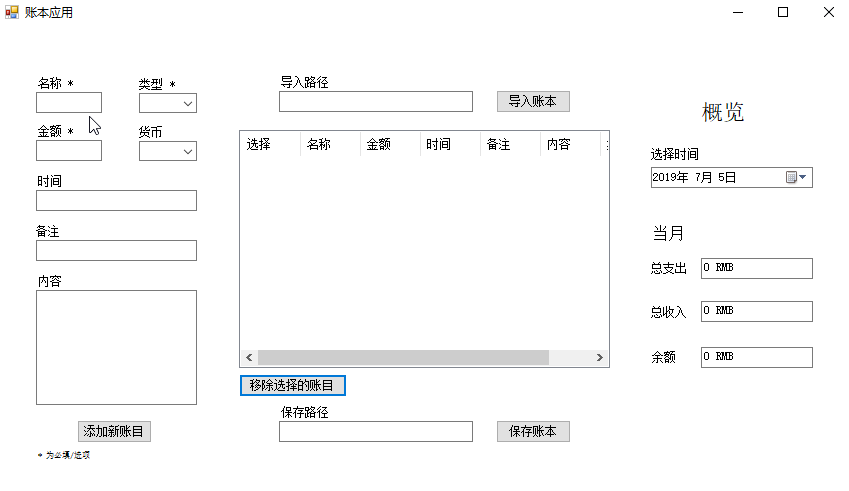
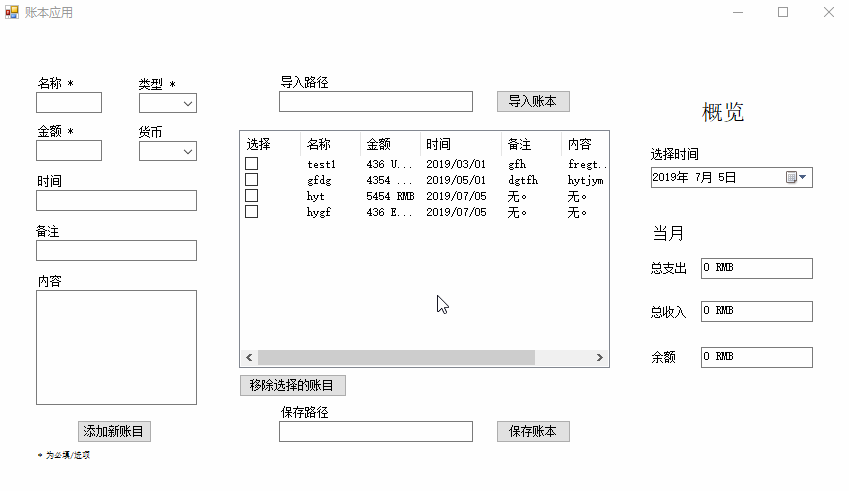
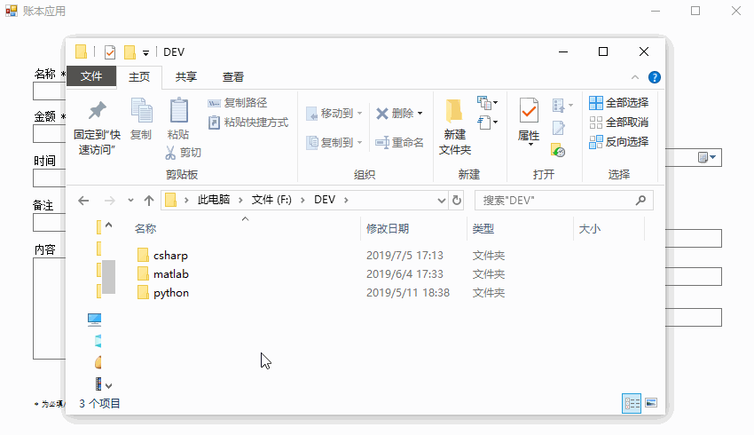
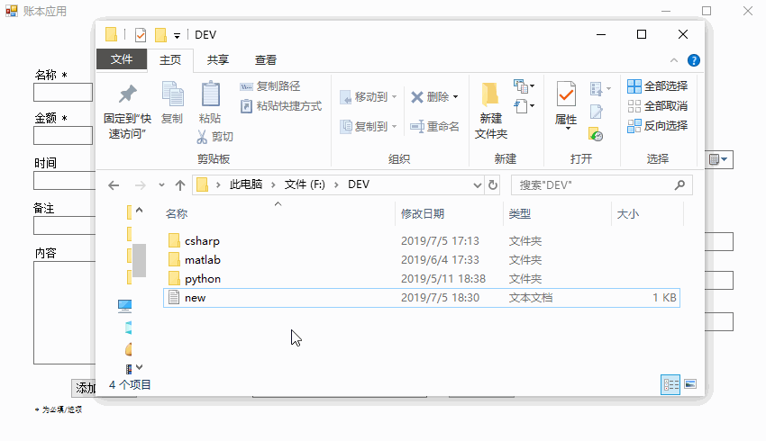
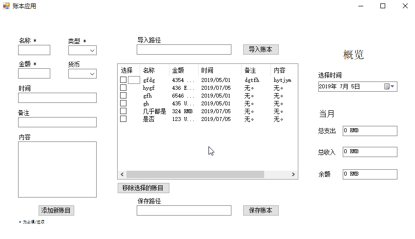
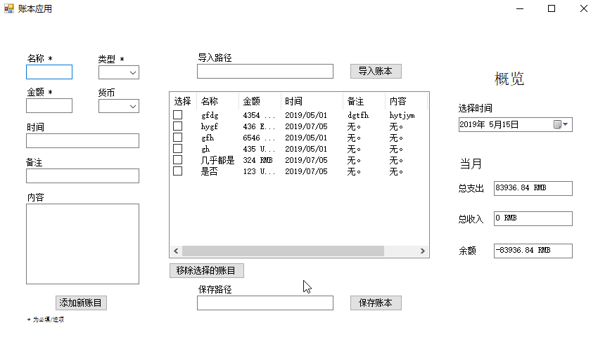

## 账本WPF应用

### 功能实现

1. 添加新账目

2. 移除账目

3. 保存账本

4. 导入账本

注意：导入时如果当前账本为保存，数据将被覆盖并丢失。

5. 分析所选当前月份的收支情况

6. 数据有效性验证，包括金额、时间、导入账本的路径、满足账目添加最低要求等。

### Todo:
- WPFv2
- v1
  - 界面颜色设计，文字提示设计 => 交互；
    - listview 中各列的间隔（“选择”这列间隔过大） 
    - 选择时间的功能删除具体到天数的显示
    - 当点击添加账目时，为所有错误项显示错误提示（颜色标注，纠正信息等）；   
    - 为导入和保存账本功能添加openfiledialog，避免手动输入路径的麻烦；
    - ...
  - accounts 与 listview 的分离，在界面显示时只选择一个为主体，避免同步时的遗忘；
